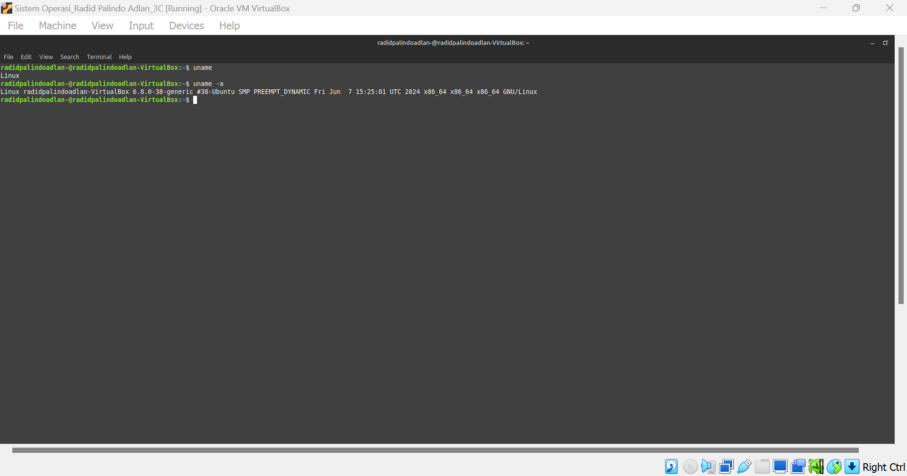

# RADID-PALINDO-ADLAN_09011282328054_SK3C_SISTEM-OPERASI-tugas-3

Nama : Radid palindo adlan\
NIM: 09011282328054\
Kelas : SK3C

## 1. Sudo apt upgrade
Fungsi dari perintah **sudo apt upgrade di Linux Mint** (dan distribusi Linux berbasis Debian lainnya) adalah untuk memperbarui semua paket yang terpasang ke versi terbaru yang tersedia di repositori perangkat lunak yang telah dikonfigurasi.\

## 2. Sudo apt update
Perintah **sudo apt update di Linux Mint** (dan distribusi Linux berbasis Debian lainnya) digunakan untuk memperbarui indeks lokal dari paket-paket yang tersedia di repositori perangkat lunak yang telah dikonfigurasi.\

## 3. Sudo apt install htop
Perintah **sudo apt install htop** di Linux Mint (dan distribusi Linux berbasis Debian lainnya) digunakan untuk menginstal aplikasi htop dari repositori perangkat lunak ke dalam sistem. **htop** adalah sebuah alat berbasis terminal yang interaktif untuk memonitor proses-proses yang berjalan di sistem secara real-time. \

## 4. Sudo apt install btop
Perintah **sudo apt install btop** digunakan untuk mengunduh dan menginstal aplikasi btop pada sistem Linux Mint (atau distribusi Linux berbasis Debian lainnya). **btop** adalah alat pemantauan sistem yang canggih dengan antarmuka pengguna berbasis teks yang interaktif. Ini menampilkan informasi tentang penggunaan CPU, memori, disk, jaringan, dan proses yang berjalan dengan cara yang mudah dipahami.\

## 5. htop
**htop** adalah alat pemantauan sistem berbasis terminal yang digunakan di Linux Mint dan distribusi Linux lainnya. Fungsinya adalah untuk memberikan informasi real-time tentang proses-proses yang sedang berjalan di sistem, termasuk penggunaan CPU, memori, dan sumber daya lainnya.\

## 6. btop
**btop** adalah alat pemantauan sistem berbasis terminal yang mirip dengan htop, tetapi menawarkan antarmuka yang lebih modern dan kaya fitur. Ini dirancang untuk memberikan informasi mendalam tentang kinerja sistem, termasuk penggunaan CPU, memori, disk, dan jaringan, semuanya dalam tampilan yang menarik dan interaktif.\

## 7. date
**date** di linux untuk menampilkan tanggal dan waktu saat ini.\

## 8. w
**w** di Linux digunakan untuk menampilkan informasi tentang pengguna yang sedang login dan aktivitas mereka.\

## 9. df -h
**df -h**  Linux digunakan untuk menampilkan informasi tentang penggunaan disk pada sistem Anda dengan format yang lebih mudah dibaca.\

## 10. du
**du** (disk usage) di Linux digunakan untuk menampilkan penggunaan ruang disk oleh file dan direktori.\

## 11. ls
**ls** Di Linux digunakan untuk menampilkan list file dan folder.\

## 12. pwd
**pwd** di Linux digunakan menampilkan jalur direktori di terminal saat ini

## 13. whoami
**whoami** di Linux digunakan menampilkan nama user yang sedang beroperasi di terminal

## 14. mkdir
**mkdir** di Linux digunakan untuk membuat suatu direktori

## 15. touch
**touch** di Linux digunakan untuk membuat file dengan format apapun

## 16. cat
**cat** di Linux digunakan untuk mengisi file lewat terminal

## 17. who
**who** di Linux digunakan untuk melihat user yang telah login

## 18. ps
**ps** di Linux digunakan untuk melihat proses apa saja yang sedang berjalan di sistem

## 19. cal
**cal** di Linux digunakan untuk melihat kalender

## 20. kill
**kill** di Linux digunakan untuk mematikan proses yang dijalankan sistem

## 21. ifconfig
**ifconfig** di Linux digunakan untuk melihat deskripsi network yang sedang tersambung ke dalam sistem

## 22. uname
**uname** di Linux digunakan untuk melihat deskripsi singkat tentang sistem kita

## 23. netstat
**netstat** di Linux digunakan untuk melihat deskripsi tentang jaringan yang tersambung dalam sistem kita

## 24. top
**top** di Linux digunakan untuk melihat deskripsi sistem kita yang sedang berjalan secara real time

## 25. file
**file** di Linux digunakan untuk menentukan suatu file format berdasarkan isi dari file

## 26. nethogs
**nethogs** di Linux digunakan untuk melihat bandwidth jaringan

## 27. help
**help** di Linux digunakan untuk melihat beberapa list command

## 28. rm
**rm** di Linux digunakan untuk menghapus file atau direktori

## 29. grep
**grep** di Linux digunakan untuk mencari pola atau teks tertentu 

## 30. history
**history** di Linux digunakan untuk melihat histori command yang telah dijalankan user

## 31. free
**free** di Linux digunakan untuk melihat memory yang terpakai dan sisanya

## 32. man
**man** di Linux digunakan untuk melihat fungsi suatu command lewat manual yang diberikan linux

## 33. ping
**ping** di Linux digunakan untuk melihat kelancaran koneksi jaringan kita

## 34. traceroute
**traceroute** di Linux digunakan untuk melihat rute ke host

## 35. nano
**nano** di Linux ialah suatu editor teks dalam terminal

## 36. echo
**echo** di Linux digunakan untuk mengeluarkan input yang kita ketik dalam terminal

## 37. cd
**cd** di Linux digunakan untuk mengganti direktori yang digunakan terminal

## 38. hostnamectl
**hostnamectl** di Linux digunakan untuk  menampilkan dan mengelola informasi tentang nama host

## 39. head
**head** di Linux digunakan untuk  menampilkan beberapa baris pertama dari suatu file txt

## 40. tail
**tail** di Linux digunakan untuk  menampilkan beberapa baris terakhir dari suatu file txt

## 41. zip
**zip** untuk mengekstrak file kedalam bentuk zip.

## 42. unzip
**unzip** untuk mengekstrak file.zip.

