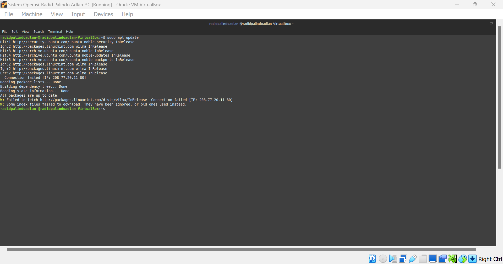

# RADID-PALINDO-ADLAN_09011282328054_SK3C_SISTEM-OPERASI-tugas-3

Nama : Radid palindo adlan\
NIM: 09011282328054\
Kelas : SK3C

## 1. Sudo apt upgrade
Fungsi dari perintah **sudo apt upgrade di Linux Mint** (dan distribusi Linux berbasis Debian lainnya) adalah untuk memperbarui semua paket yang terpasang ke versi terbaru yang tersedia di repositori perangkat lunak yang telah dikonfigurasi.\

## 2. Sudo apt update
Perintah **sudo apt update di Linux Mint** (dan distribusi Linux berbasis Debian lainnya) digunakan untuk memperbarui indeks lokal dari paket-paket yang tersedia di repositori perangkat lunak yang telah dikonfigurasi.\

## 3. Sudo apt install htop
Perintah **sudo apt install htop** di Linux Mint (dan distribusi Linux berbasis Debian lainnya) digunakan untuk menginstal aplikasi htop dari repositori perangkat lunak ke dalam sistem. **htop** adalah sebuah alat berbasis terminal yang interaktif untuk memonitor proses-proses yang berjalan di sistem secara real-time. \

## 4. Sudo apt install btop
Perintah **sudo apt install btop** digunakan untuk mengunduh dan menginstal aplikasi btop pada sistem Linux Mint (atau distribusi Linux berbasis Debian lainnya). **btop** adalah alat pemantauan sistem yang canggih dengan antarmuka pengguna berbasis teks yang interaktif. Ini menampilkan informasi tentang penggunaan CPU, memori, disk, jaringan, dan proses yang berjalan dengan cara yang mudah dipahami.\

## 5. htop
**htop** adalah alat pemantauan sistem berbasis terminal yang digunakan di Linux Mint dan distribusi Linux lainnya. Fungsinya adalah untuk memberikan informasi real-time tentang proses-proses yang sedang berjalan di sistem, termasuk penggunaan CPU, memori, dan sumber daya lainnya.\

## 6. btop
**btop** adalah alat pemantauan sistem berbasis terminal yang mirip dengan htop, tetapi menawarkan antarmuka yang lebih modern dan kaya fitur. Ini dirancang untuk memberikan informasi mendalam tentang kinerja sistem, termasuk penggunaan CPU, memori, disk, dan jaringan, semuanya dalam tampilan yang menarik dan interaktif.\

## 7. date
**date** di linux untuk menampilkan tanggal dan waktu saat ini.\

## 8. w
**w** di Linux digunakan untuk menampilkan informasi tentang pengguna yang sedang login dan aktivitas mereka.\

## 9. df -h
**df -h**  Linux digunakan untuk menampilkan informasi tentang penggunaan disk pada sistem Anda dengan format yang lebih mudah dibaca.\

## 10. du
**du** (disk usage) di Linux digunakan untuk menampilkan penggunaan ruang disk oleh file dan direktori.\

